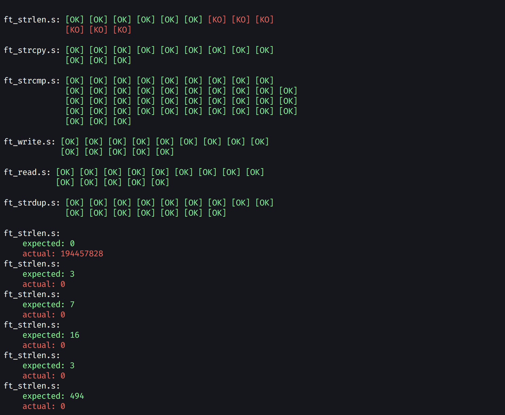

# libasm test

Unit tests for the libasm project.

## Usage

- `> make run` show regular pretty output.
- `> make run_raw` show parsable output.

### Bonus

Suffix all Makefile commands with `bonus` i.e `> make runbonus`.

## Configuration

The default path to your libasm is `../libasm`. You can modify it in the Makefile.
